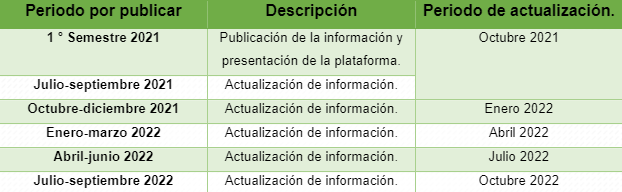

# 3.2 Plan de apertura

Un **plan de apertura** deberá ser el documento de referencia en donde se plasmen los conjuntos y recursos de datos a publicarse por el sujeto obligado. Este deberá elaborarse de manera periódica y actualizarse constantemente para consulta de la ciudadanía.

## Elaboración

Para el plan de apertura se deberá considerar lo siguiente:

1. Conformar un listado público de los datos generados o administrados por el sujeto obligado.
2. Documentar los mecanismos de priorización utilizados para la selección de los conjuntos de datos que se abrirán en formatos abiertos.
3. Señalar al público las fechas para la publicación de aquellos conjuntos de datos en formatos abiertos.

<figure><figcaption>
Ejemplo Plan de Apertura
</figcaption></figure>

## **Eliminación o cambios significativos**

Los datos publicados son conjuntos que suponen un cierto uso, reúso y redistribución por cualquier persona. La modificación significativa o eliminación de la publicación de algún recurso de datos deberá evitarse en lo posible o en caso de que esto suceda, se deberá hacer pública la razón y fundamento en la descripción del recurso.
